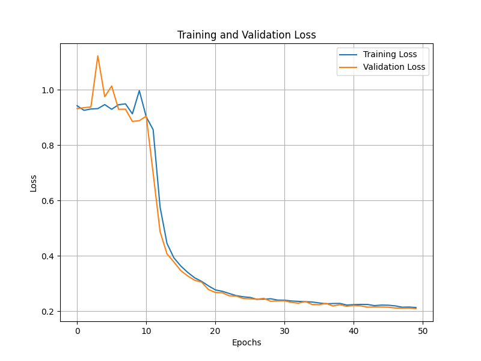
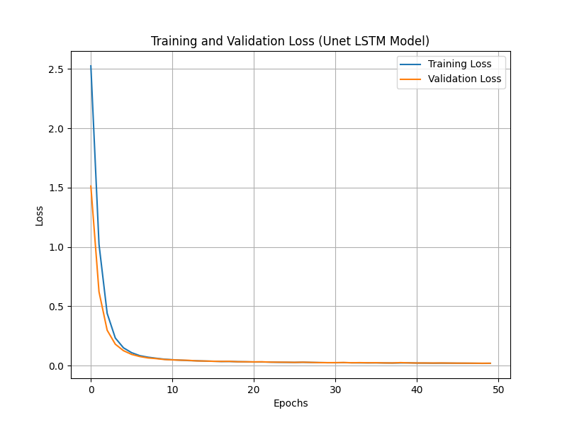
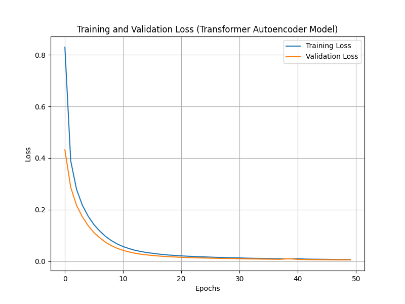

# Anomaly Detection in Flight Simulation Time Series

> **5th-year engineering research project** — Deep learning-based anomaly detection on multivariate flight simulation data using LSTM and Transformer autoencoders.

---

## Table of Contents

- [Overview](#overview)
- [Project Structure](#project-structure)
- [Dataset](#dataset)
- [Methods & Models](#methods--models)
- [Results](#results)
- [Installation](#installation)
- [References](#references)

---

## Overview

This project addresses the problem of **unsupervised anomaly detection** in multivariate time series generated from flight simulator data. The goal is to reconstruct pilot orders using an AI model, then compare predicted vs. real commands to flag anomalous behavior — without relying on labelled anomaly data during training.

**Key objectives:**
- Reconstruct multivariate pilot command signals (pitch, roll, speed, takeoff/landing, etc.) from flight simulation scenarios
- Detect deviations between predicted and real pilot orders using reconstruction error
- Benchmark multiple deep-learning architectures on this task

---

## Project Structure

```
Projet-RI-5A/
├── Dataset/                            # HDF5 flight scenario files (~950 scenarios)
│   ├── TimeSeries_Scenario_*.h5        # Normal flight scenarios
│   └── *_shift_on___flight_director_*  # Anomalous scenarios (injected shift)
├── Images/
│   ├── 1_avant_downsampling.png        # Signal visualization before downsampling
│   ├── 2_apres_downsampling.png        # Signal visualization after downsampling
│   ├── 3_loss_plot.png                 # LSTM Autoencoder training loss
│   ├── 4_loss_plot_unet.png            # LSTM U-Net Autoencoder training loss
│   └── 5_loss_plot_transformer.png     # Transformer Autoencoder training loss
├── Model_trained/
│   ├── lstm_autoencoder_model.h5       # Trained LSTM Autoencoder
│   ├── transformer_autoencoder_model.h5
│   └── lstm_unet_autoencoder_model.h5
├── Notebook_detection_anomalies.ipynb  # Main analysis notebook
├── Report.pdf                          # Full project report
├── Slides_presentation.pdf             # Presentation slides
└── README.md
```

---

## Dataset

- **Source:** Multivariate flight simulation time series (HDF5 format)
- **Size:** ~950 scenarios (`TimeSeries_Scenario_00001` → `00950`)
- **Variables:** Pilot command signals including `flight_director_pitch`, `flight_director_roll`, and other flight parameters
- **Anomalies:** A subset of scenarios contain synthetically **injected shift anomalies** on `flight_director_pitch` and `flight_director_roll`, identifiable by the filename suffix `_shift_on___flight_director_pitch__flight_director_roll.h5`
- **Preprocessing:** Downsampling applied to reduce time series length while preserving signal structure

| | Before Downsampling | After Downsampling |
|---|---|---|
| **Signal** |  |  |

---

## Methods & Models

All models follow an **autoencoder** paradigm: trained only on normal data, anomalies are flagged when the reconstruction error exceeds a learned threshold.

### 1. LSTM Autoencoder
- Encoder/decoder built with stacked LSTM layers
- Captures temporal dependencies in sequential data
- Training loss:

  

### 2. LSTM U-Net Autoencoder
- Skip connections between encoder and decoder (U-Net style)
- Preserves fine-grained temporal features
- Training loss:

  

### 3. Transformer Autoencoder
- Self-attention mechanism replaces recurrence
- Better at capturing long-range dependencies
- Training loss:

  

---

## Results

Models are evaluated on their ability to reconstruct normal scenarios with low error, and to produce **high reconstruction error on anomalous scenarios** (with injected shift).

Full quantitative results and analysis are available in [Report.pdf](Report.pdf).

---

## Installation

```bash
# Clone the repository
git clone https://github.com/NaUl51/Projet-RI-5A
cd Projet-RI-5A

# Create a virtual environment (recommended)
python -m venv venv
venv\Scripts\activate  # Windows

# Install dependencies
pip install numpy pandas matplotlib scikit-learn tensorflow keras h5py jupyter
```

> **Python version:** 3.9+  
> **Framework:** TensorFlow / Keras

---
## References

- Malhotra et al., *LSTM-based Encoder-Decoder for Multi-sensor Anomaly Detection*, 2016
- Vaswani et al., *Attention Is All You Need*, NeurIPS 2017
- Ronneberger et al., *U-Net: Convolutional Networks for Biomedical Image Segmentation*, 2015
- Pang et al., *Deep Learning for Anomaly Detection: A Review*, ACM Computing Surveys, 2021

---

*Project supervised at INSA Toulouse and SII Sud-Ouest / Engineering School — January 2025*
